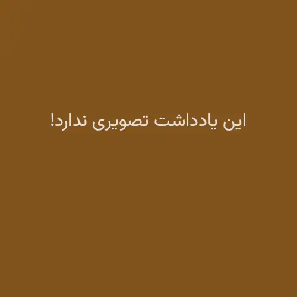

از یک سال و چند ماه قبل که اینجا را راه انداخته‌ام اولین مرتبه است که بیش از یک ماه است چیزی ننوشته‌ام. ظاهراً یک ماه و شش روز…

 حواسم هست که می‌آیید سر می‌زنید که بفهمید حالم خوب است؟ چه می‌کنم؟ اوضاعم چه طور می‌گذرد و بعد هم دست از پا درازتر صفحه را می‌بندید. می‌دانم این طور بی‌خبر گذاشتن رفقا بی‌معرفتی است اما راستش اوضاع خودم هم بهتر نیست. من هم چیزی بیش‌تر از شما نمی‌دانم.

چند روز پیش پوریا پرسید فال امسالت چی در اومد و من یادم افتاد که امسال فال نگرفته‌ام. یادم افتاد که مدت‌هاست حافظ نخوانده‌ام.

شاید از هشت نه ماه پیش که صد سال تنهایی را نصفه رها کردم دیگر کتاب قصهٔ جدیدی نخواندم. چند روز پیش تولدم بود و برادرم برایم دنیای سوفی را هدیه خرید. حواسش بود که هیچ وقت نخوانده بودمش. به رسم ادب کتاب را باز کردم تا بخوانمش که خیالش آسوده باشد که هدیهٔ مناسبی خریده اما راستش خیلی زود حوصله‌ام سر رفت و کتاب را بستم و دیگر هیچ وقت بازش نکردم. 

کمی سخت سلیقه شده‌ام. هر چیزی به ذائقه‌ام خوش نمی‌آید. انگار به اندازهٔ قبل خالی نیستم که جا برای هر چیزی داشته باشم…

دیروز خیلی غصه خوردم وقتی مهسا داشت تعریف می‌کرد که وقتی جوان‌تر بوده با این امید می‌نوشته که در میان‌سالی روزی نوشته‌های جوانی‌اش را به دخترش نشان دهد تا او بداند که مادرش سال‌ها قبل در شور جوانی چه جور می‌اندیشیده و چگونه می‌زیسته اما حالا که دوران جوانی‌اش کم‌کم دارد به انتها می‌رسد خیال می‌کند که شاید هیچ وقت مادر دختری نباشد.

این‌ها را ننوشتم که بگویم اوضاع بد است. اتفاقاً خیلی هم خوب است. نفسی می‌آید و لقمه نانی هست و حال خوشی در کنار رفقا اما خُب می‌دانید…

پرمشغله‌تر از همیشه روزها سریع‌تر از قبل می‌گذرد. افسردگی‌های دوره‌ای که قبل‌تر گاه به گاه به سراغم می‌آمد را از پای درآورده‌ام. پرانرژی‌تر از قبلم و روزها خوب می‌گذرد اما می‌دانید این چیزی نبود که خیالش را می‌بافتم.

نه اینکه بد باشد. اتفاقاً خیلی هم خوب است. قبل تر هم در یادداشت [این دنیا جای ماندن نیست](/blog/mother-and-son) نوشته بودم که این دنیا جای ماندن نیست! می‌دانید؟ مادّیون وقتی ببینند که هیچ کدام از رؤیاهایشان محقق نشده ناراحت می‌شوند، افسردگی می‌گیرند و دست به خودکشی می‌زنند اما من خدا را شکر هنوز اعتقادی هر چند اندک برایم مانده و همین کمکم می‌کند که حالم خوب باشد. نه این که صرفاً خوب باشد. اتفاقاً بهتر هم هست. 

راستش خیال می‌کنم بزرگ‌تر شده‌ام. اگرچه حواسم هست که هنوز خیلی کوچکم و خیلی مانده تا خیلی چیزها را بفهمم اما وقتی خودم را با خود گذشته‌ام، خود زمان مدرسه و خود زمان دانشگاه مقایسه می‌کنم می‌فهمم که بزرگ‌تر شده‌ام. پخته‌تر شده‌ام. حالا می‌توانم دنیا را همان طور که هست بپذیرم و با زشتی‌هایش کنار بیایم. زشتی؟!

این چشم زشت ماست که گاهی چیزهایی را زشت می‌بیند که مگر می‌شود خدا چیزی را زشت بیافریند؟! که هر چه آفریده خیر محض است.

همین مهرانِ بیست و هفت ساله هم با همهٔ کم و کاستی‌هایش آفریدهٔ همان خدای مهربان است و وجودش خیر محض است مثل همهٔ‌ آفریده‌های دیگر…

پیر ما گفت خطا بر قلم صنع نرفت  
آفرین بر نظر پاک خطاپوشش باد