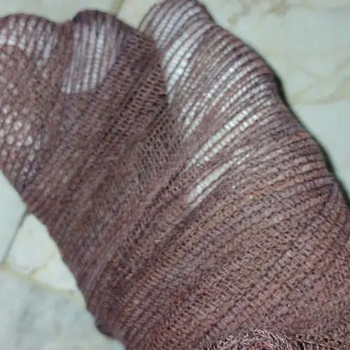

شانزده هفده سال پیش بود که ساعت یک و دو بعد از نصفه شب تلفنمان زنگ خورد. از همان روز هر بار که بعد از ده شب تلفنمان زنگ بخورد تپش قلب می‌گیرم.

زنگ زدند و خبر دادند که مادربزرگ پدری‌ام تصادف کرده و پایش شکسته؛ پاشید بیایید بیمارستان! 

خب باید صادقانه خدمت‌تان عرض کنم که اگر ساعت دو نصفه شب زنگ زدند خانه‌تان و خبر دادند که کسی پایش شکسته شستتان خبردار شود که پاشکستنی در کار نیست و باید همراه خودتان پیراهن مشکی ببرید…

خلاصه که ما رفتیم و پیراهن مشکی نبردیم. یعنی پیراهن مشکی نداشتیم که ببریم. در خانهٔ ما کسی پیراهن مشکی نمی‌پوشد. رفتیم آنجا و اقوام و آشنایان پیراهن مشکی‌هایشان را برایمان آوردند که به قول خودشان این طوری دهن مردم بسته بماند و حرف پشتمان زیاد نشود. شادی روح متوفی هم که به آنجایشان. اصلاً می‌دانید؟! حرف زنده‌هاست که مهم است و آن که معدوم شده که خُب معدوم شده و ما را چه کار که شاد باشد یا ناراحت؟!

در **به نام پدر** حاتمی‌کیا وقتی پای گلشیفته می‌رود روی مین، زنگ می‌زنند و به مادرش خبر می‌دهند که پای دختر دلبندتان رفته است روی مین؛ پاشید بیایید اینجا که تنها نباشد. او هم چادر مشکی‌اش را سر می‌کند و راه می‌افتد. بماند که چادر مشکی لباس همیشگی‌اش است! وقتی می‌رسد و گلشیفته را زنده می‌یابد حمد خدا می‌گوید که تنها پای دخترش صدمه دیده. نمی‌دانم. شاید اینجا جایش نباشد ولی من در در حین تماشای این فیلم بسیار گریه کردم. بگذریم…

یکی دو هفتهٔ پیش میلاد، برادرم، زنگ می‌زند و به بابا مامانم خبر می‌دهد که مهران سوخته؛ پاشید بیایید…

وقتی چشمان پدر و مادرم به سر و صورت سالم من می‌افتد کلی ذوق می‌کنند از این که فقط دو دستم سوخته و بقیهٔ بدنم از جمله صورتم صحیح و سلامت است.

توضیح بیش‌تر نمی‌دهم. از عنوان یادداشت پیدا است که وقتی یک نفر هر دو دستش پانسمان باشد به چه مصیبتی گرفتار می‌آید…

پی‌نوشت: خدا را شکر که آبی که با آن سوختم جوش نبود. اما به دلیل مدت زمان طولانی تماس دستانم با آب داغ، سوختگی خیلی هم سطحی نیست. در هر صورت حالا حالم خوب است و دارم با انگشتان  متورم و زخم خودم تایپ می‌کنم.