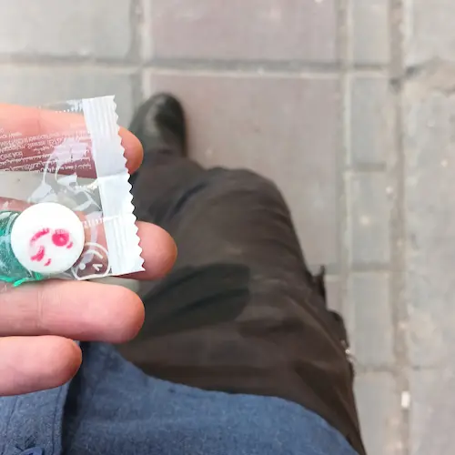

خُب انگار رکورد ننوشتن را جابجا کرده‌ام. دیروز بعد از مدت‌ها به بازخوانی یادداشت‌های قبلی‌ام نشسته بودم که دلم به حال این روزها سوخت. روزهایی که گذشتند و ننوشتم‌شان و چون ننوشتمشان خیلی زود از تاریخ محو خواهند شد. 

روزهای قشنگی که مظلوم واقع شدند و غصه خواهند خورد هر بار که یادداشت‌های قبلی و بعدی‌شان (ان‌شاءالله تبارک و تعالی) خوانده بشود.

حالا که دارم می‌نویسم انگار که سرعت تایپ فارسی‌ام هم پایین‌تر از قبل است. راستش فعلاً بنابر اجبار از لینوکس مهاجرت کرده‌ام به مک او اسِ به درد نخور. آنجا که بودم راحت‌تر می‌توانستم بنویسم اما این جا دردسر دارد. هیچ چیز سر جای خودش نیست. البته که همهٔ این‌ها بهانه‌هایی بیش نیست برای این ننوشتن طولانی. بگذریم...

بس است دیگر ننوشتن. دوباره باید بنویسم از این روزها که مبادا محو شوند از دل تاریخ. بنویسم تا سال‌های بعد با دیدنشان یادم بیاید روزهایی که گذرانده‌ام را. 

یادداشت‌هایی که از این پس خواهم نوشت خیلی‌هایشان مربوط به همین دوران ننوشتن است. روی آن‌ها تاریخ روزی که نوشته می‌شوند را می‌نویسم اما بی‌شک مخاطب از حال و هوای نوشته و اشارتی که در آن می‌یابد خواهد فهمید که آن چه می‌خواند شرح وقایع ماقبل‌ است و ما را خواهد بخشید که تاریخ دقیقی برای آن‌‌ها نمی‌یابد. بگذریم...

 پیش‌تر دربارهٔ 
[سوختگی و کون‌نشوری‌ام](/blog/i-am-a-kun-nashour)
 نوشته بودم. حالا باید با کمال افتخار اعتراف کنم همان پسرک کون‌نشور حالا عضوی از دار و دستهٔ شاشوهاست.

یکی از روزهای ماه رمضان بود. زودتر از همیشه از محل کارم زدم بیرون که روی ماه یکی از دوستان را ببینم. دو ساعتی مانده بود به اذان که خسته و گرسنه حوالی بزرگراه امام‌علی سوار بی‌آرتی‌های خاوران-آزادی شدم. راستش قبل از این که سوار بی‌آرتی بشوم می‌فهمم فشار مثانه‌ام را اما جایی را نمی‌یابم و با همان مثانهٔ‌ پر سوار می‌شوم.

 میانهٔ راه ضعف می‌کنم و سرم گیج می‌رود و در حالی که هیچ کجا را نمی‌بینم رد آب را روی پاهایم حس می‌کنم.

آب نیست اما... مثانه مبارک تا صاحب خانه را این چنین ضعیف یافته، آزاد و رها خودش را رها کرده است.

در همین حال و هوا سعی می‌کنم که یکی از شکلات‌هایی را که قبل‌تر ساره  داده بود را از توی قاب عینکم در بیاورم  اما دستانم یاری نمی‌دهد. خیلی ناتوان شده‌ام. هیچ کاری نمی‌توانم بکنم. خدایا؟! می‌بینی بندهٔ ضعیفت را؟! 

> وَ اَنْتَ تَعْلَمُ ضَعْفى عَنْ قَليلٍ مِنْ بَلاءِ الدُّنْيا وَ عُقُوباتِها وَ ما يَجْرى فيها مِنَ الْمَكارِهِ عَلى اَهْلِها
عَلى اَنَّ ذلِكَ بَلاءٌ وَ مَكْرُوهٌ قَليلٌ مَكْثُهُ يَسيرٌ بَقائُهُ قَصيرٌ مُدَّتُهُ
فَكَيْفَ احْتِمالى لِبَلاءِ الآخِرَةِ وَ جَليلِ وُقُوعِ الْمَكارِهِ فيها
وَهُوَ بَلاءٌ تَطُولُ مُدَّتُهُ وَ يَدُومُ مَقامُهُ وَ لا يُخَفَّفُ عَنْ اَهْلِهِ لاِنَّهُ لا يَكُونُ اِلاّ عَنْ غَضَبِكَ وَاْنتِقامِكَ وَ سَخَطِكَ

نمی‌توانم روی پاهایم بایستم. مثانه هم که خالی شده و کاری به کارم ندارد. همان جا با خیال راحت چمباتمه می‌زنم.

می‌رسیم. با هزار سختی و زحمت پیاده می‌شوم. کمی بهتر شده‌ام. حالا می‌توانم شکلاتم را از داخل قاب عینک در بیاورم. اما دو دلم که بخورم یا نه. ماه رمضان است آخر. اگر بخورم روزه‌ام باطل می‌شود؟!  حالا اما فرصت مناسبی برای این محاسبات نیست. باید بخورم. یکی می‌خورم و راه می‌افتم. 

باید چند قدمی راه بروم و یک اتوبوس دیگر سوار شوم. توی راه وارد یک گاراژ می‌شوم و سراغ مستراح را می‌گیرم. راهنمایی‌ام می‌کنند. چیز زیادی برای خالی کردن نمانده.  همان چند قطره را خالی می‌کنم و سوار اتوبوس بعدی می‌شوم. 

گوشی‌ام دارد اذان می‌گوید. هنوز توی اتوبوسم. خانمی با بسته‌های افطاری ساده وارد اتوبوس می‌شود و میان مسافران پخش می‌کند. نذر امام حسن است. خیلی به موقع است. خرماها را یکی یکی می‌گذارم دهنم و مزه مزه می‌کنم. طعم بهشت می‌دهد.

خدایا شکرت برای نعمت‌هایت...

پی‌نوشت: معمولا شکلات نمی‌خورم. برای همین وقتی شکلات‌ها در جیبم می‌مانند بعد از مدتی غیر قابل استفاده می‌شوند. برای همین چند وقتی‌است که آن‌ها را داخل قاب عینکم نگه می‌دارم تا صحیح و سالم بمانند و روزی به کار آیند.