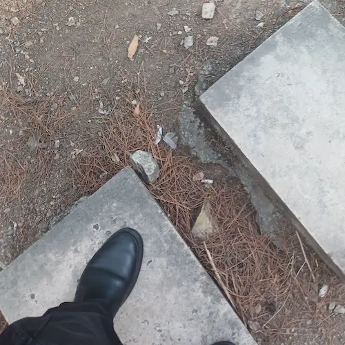

جمعه است. جایت خالی است. جمعه‌ها آدم می‌تواند توی خانه کلی کار بکند اما تو که نیستی انگار هیچ کدامشان به دلم نمی‌نشیند. نه که انجامشان ندهم. نه. انجام می‌دهم اما مزه نمی‌دهد. 

صبح کفشم را واکس زدم. کاش تو بودی و واکس زدنم را تماشا می‌کردی. حس می‌کنم وقتی تو نگاهم کنی کفش‌هایم بهتر واکس می‌خوردند. کاش تو بودی و قبل اینکه واکس زدن را شروع کنم نگاه می‌کردم به صورت ماهت. به چشمان زیبایت که دوخته شده بودند به صورت پسری که دوستش داری. می‌پرسیدم که می‌خواهی که برای تو هم بزنم. چشمانت برق می‌زد و آرام سرت را تکان می‌دادی که  یعنی آره. می‌خواهم.

فوری دست می‌کردم و کفشت را از داخل جاکفشی می‌کشیدم بیرون.

صدایم می‌کردی:

> اون که نه. اون یکی.

منم می‌خندیدم و در جوابت می‌گفتم:

> همون که نمی‌پوشیش؟! 

  و شروع می‌کردم به واکس زدن. لابه‌لای واکس زدن نگاهت می‌کردم و به لبخند پهنت روی لبان شیرینت چشم می‌دوختم. وه که چه بی‌اندازه دلم برایت تنگ است.

داشتم کتاب‌‌خانه‌ام را مرتب می‌کردم. خاک‌هایش را پاک کردم و کتاب‌ها را کمی جابجا کردم تا نظم به هم خوردهٔ‌شان را دوباره بازیابند. راستش خیلی وقت است که کمتر کتاب می‌خوانم؛ انگار سوخت به موتور کتاب‌خوانی‌ام نمی‌رسد. کجایی پس؟! چرا نیستی؟! 

رد نگاهم روی کتاب‌ها می‌ماند. آن‌هایی که می‌شود دوتایی بخوانیم را به خاطرم می‌سپارم تا وقتی تو بودی برایت بخوانم.  کاش بیایی. کاش بیایی که با هم بخوانیم.

همین حالا که دارم این‌ها را می‌نویسم با خودم می‌گویم کاش تو بودی. کاش بودی و یواشکی تماشایم می‌کردی. جلو نمی‌آمدی که مبادا حواسم پرت شود.

 یادداشت‌هایم را دوست داری. از دور تماشایم می‌کنی که زودتر بنویسم.

زودتر بنویسم که چه بشود؟! دلت یادداشت جدیدم را می‌خواهد یا خودم را؟! همین سؤال را از خودت می‌پرسم. لبخندت پهن‌تر می‌شود اما جوابی نمی‌دهی. 

در پاسخ به جوابی که نمی‌دهی می‌گویم:

> هان. چیه؟! چرا جواب نمی‌دی؟! زبونت رو موش خورده؟!

می‌گویی:

> به کارت برس شلوغ نکن. می‌رم دیگه تماشات نمی‌کنما.

یک چَشم تحویلت می‌دهم و  سرگرم نوشتن می‌شوم.  دارم می‌نویسم که با یک لیوان چای می‌آیی. عادت داری که لیوانی بریزی. عوض دو فنجان چای یک لیوان می‌ریزی. فنجان‌هایت را گذاشته‌ای شاید برای سی و یک سال بعد. وقتی حسابی پیر شده‌ایم. وقتی معده‌هایمان کوچک‌تر شده است. اما نمی‌دانم چرا فنجان‌هایت دوتاست؟! کاش یکی‌اش زودتر بشکند. آخر هیچ دلم نمی‌خواهد از فنجانی که رد سرخی لبانت روی آن نیست چای بنوشم. 

هنوز دارم می‌نویسم. صدایم می‌کنی:

> مهران

خوشم می‌آید از این جور صدا زدنت.

> جانم عزیزم

خودت را لوس می‌کنی، دستانت را می‌گیری سمتم و می‌گویی:

> بنزینش تموم شده!

خنده‌ام می‌گیرد.

حوصله‌ت سر رفته. آمده‌ای که سربه‌سرم بگذاری. می‌گویم:

> خُب بیار برات پرش کنم. 

خودت را مظلوم می‌کنی:

> من که نمی‌دونم کجاست!

حتماً باید از جایم بلندم کنی. کار همیشگی‌ت است. 

از جایم بلند می‌شوم و توی دلت می‌گویی:

> چه خوبه که اگه استفاده نکنم هم هر هفته باید برام پرش کنه...

این یادداشت را که بنویسم راهی شاه عبدالعظیم می‌شوم. کربلا دور است. در کشور دیگر است. مشهد هم دور است در شهری دیگر است. قم هم دور است. باشد. قبول. اما انصافاً سید الکریم نزدیک است. بی انصافی است اگر به زیارتش نرویم. اما راستش این یکی هم بی تو بهم نمی‌چسبد. 

جایت روی صندلی خالی کنارم خالی است. که موقع رانندگی دستانم را بگیری. ذوق کنم و با خنده بگویم لعنتی ما مثل شما اتومات نیستیم. دنده داریم...

---

پی‌نوشت: دیدی که به قولم عمل کردم؟!