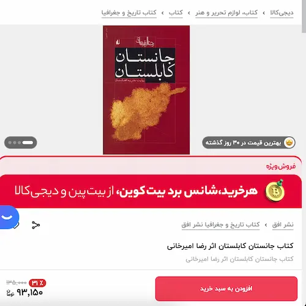
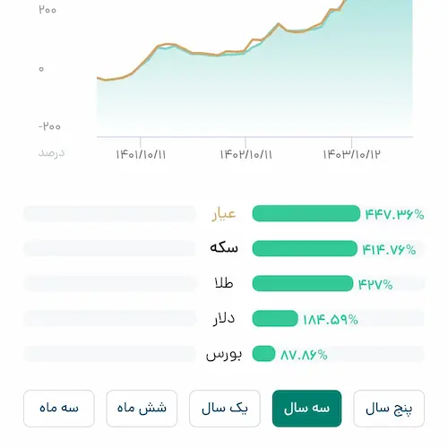

سال نود و نه یدونه از این جانستان کابلستان‌ها خریدم به قیمت ۵۳ هزار تومان.

امروز جستجویی کردم تا ببینم تورم چه بلایی بر سرمان آورده. دیجی کالای عزیز گذاشته نود و سه هزار و صد و پنجاه تومان.

جانستان کابلستان روایت سفر رضای امیرخانی است به دیار دوست و همسایه افغانستان. 

موضوع این یادداشت اما افغانستان نیست. رضای امیرخانی هم نیست. تورم و افزایش قیمت کتاب هم نیست. پس چیست؟!

کوه!

بله کوه! جانستان کابلستان مقدمه‌ای دارد شیرین که قصهٔ فتح دماوند است:

> بار اول، اوایل دههٔ هفتاد بود به گمانم. با دو-سه رفیق هم دانشگاهی هوس دماوند کردیم. سرگروه نشست و برنامه‌ای توجیهی گذاشت، قبل از سفر؛ سه هفتهٔ متوالی زدنِ قلهٔ توچال و بعد حرکت به سمت دماوند در هفتهٔ چهارم. هر سه هفته گرفتار کار بودم و توچال نرفتم. هفتهٔ چهارم هم شبی که قرار بود فردایش برنامهٔ صعود داشته باشیم، با رفقا نشسته بودیم در زاویهٔ مقدسهٔ کافه هما به گعده تا نزدیک سحر! آن سفر نتوانستم قله را بزنم. خوب یادم هست. جوان بودم و سرِ حال. برنامه گذاشته بودیم برای صعود شبانه. قرار بود هیچ کدام بار اضافه‌ای نبریم. بین ما فقط پسرعمهٔ کیا بود که کوله‌ای همراه خود می‌آورد. در استراحت نیم‌ساعتهٔ اول که همه بریده بودیم، از محتویات کوله‌اش پرسیدیم. باز کرد و دوربین و سه‌پایه‌ای  نشان‌مان داد. همراه با پارچه‌نوشته‌ای بزرگ که روی آن نوشته بود، قلهٔ دماوند و زیرش هم اسم مبارکش به خط تستعلیق! 

> راستش را بخواهید این اعتماد به نفس او، کیا را از پا انداخت. کیا همان جا سر و ته کرد و برگشت به سمت پناهگاه. اما من باز هم ادامه دادم! در سکوت شب راه می‌پیمودیم. بدون حتی یک گرم بار اضافی؛ حتی‌تر به توصیهٔ سرگروه بدون یک کلام حرف اضافی؛ مبادا که نفس کم بیاوریم!

> یکهو دیدم سر و صدایی می‌آید. انگار بزن-برقصی در کار بود! اول خیال کردم توی تاریکی دچار وهم شده‌ام. اما بعد دیدم باقی هم همین حس را دارند. زودتر از وقت ایستادیم به استراحت. یاد حمام جنیان افتاده بودیم. فقط نمی‌دانستیم وقت عزاست یا عروسی. نفس‌هامان گرفته بود و حتی نمی‌توانستیم راجع به این اتفاق چند کلمه‌ای اختلاط کنیم. عاقبت صدا نزدیک‌تر شد! 

> یک  گروه بودند از کردهای مهاباد. در حالی که ما به خاطر خستگی و فشار پایین هوا حتی نای حرف زدن نداشتیم یکی دو تا دف گرفته بودند دستشان و می‌زدند و باقی هم می‌خواندند. در حالی که ما حتی یک گرم بار اضافه از پناهگاه بالا نیاورده بودیم و فقط توی قمقمه‌های فوق تخصصی کمی شربت آبلیموی شیرین داشتیم چندتایی پیت پنیر را سر دست گرفته بودند و بالا می‌بردند. دیگری هم نصفه گونی سیب‌زمینی روی دوش انداخته بود. ما لباس‌های کوه داشتیم اما دوستانمان با همان لباس‌های کردی معمولی بودند. بعد هم شروع کردند با ما به حال و احوال اینکه دارید برمی‌گردید که این قدر بی‌حالید یا ...

> من که حتی از آن پارچه‌نوشته کم نیاورده بودم از دیدن این گروه چنان حالم خراب شد که همان جا از خیر قله زدن گذشتم و برگشتم و تا صبح پیش کیا خوابیدم! با خدا گلایه می‌کردم که اگر آدمی این است که تو آفریدی و می‌تواند در ارتفاع بالای چهار هزار متر پیت حلبی روی دوش بگذارد و با صدای بلند چهچههٔ بلبلی بزند پس ما را برای چه خلقت فرمودی؟!

آری. امیرخانی این گونه حکایت صعودهایش را شرح می‌دهد تا آنجا که می‌رسد به مرداد هشتاد و هشت و می‌نویسد:

> ایستادیم برای عکس گرفتن و مدرک دیجیتال ساختن ...

این مقدمه را که می‌خواندم اولین مرتبه‌ای بود که در عمر شریف دلم خواست قله بزنم. قله هم نزدم نزدم. به جهنم. لااقل کوه ندیده خاکم نکنند.

راستش تنها تجربهٔ شبه کوه‌نوردی‌ام شهریور نود و چهار بود که چند تا از بچه‌های مدرسه دستم را گرفتند و به زور با خودشان بردند دربند. 

نفری یک کنسرو لوبیا برده بودیم که گرسنه نمانیم. چهار قدم رفتیم. کنسروهایمان را سرد خوردیم و چند تا عکس یادگاری انداختیم و تا متروی تجریش پیاده آمدیم و بحث داغمان هم این بود که اگر یک جعبه کون‌قرمز را بکشیم و چص‌دود نکنیم زنده می‌مانیم یا نه؟!

اما از وقتی که حکایت زدنِ قلهِ دماوندِ رضایِ امیرخانی را شنیدم همیشه با خودم می‌گفتم من هم یک روز قلهٔ دماوند را خواهم زد. اما راستش در این چند سال قله زدن که هیچ، حتی نزدیک کوه هم نشدم. احتمالاً نزدیک‌ترین فاصله‌ام با کوه، امامزاده صالح بوده و بس.

دوره‌ٔ دانشگاه هم شریف گروه کوه داشت و خاطرم هست که بچه‌ها عضو بودند و قله می‌زدند و از این داستان‌ها اما من هیچ وقت پیگیر نبودم.

بعدتر وقتی پوریا راهی مغرب‌زمین بود توی بار و بندیلی که نمی‌شد با خودش ببرد مت و کپسول و گاز و از این جور وسیله‌ها داشت. آن روز خیلی دلم کوه خواست. دلم پوریا را خواست دلم روزهایی را خواست که حالا گذشته بودند.

در این چهارصد و چهار اما، کودکان فرشته‌اند سبب خیر شد و دست چند تا از این داوطلب‌ها را گذاشت در دستم که  ببرمشان دارآباد تا آشغال‌های پای رود را جمع کنند که آنهایی که می‌روند قله بزنند از دیدن زباله‌ها خلقشان تنگ نشود.

البته که قله نزدیم و کاری هم که کردیم ذیل موضوع کوه‌نوردی نمی‌گنجد اما خب بعد از گذشت ده سال از عکس‌های یادگاری که در دربند انداخته بودیم دوباره به کوه نزدیک شدم و عکس‌هایی دیگر به دفتر خاطراتم اضافه شد و این نوید آینده‌ای بهتر را می‌دهد. آینده‌ای که یک دوربین و سه‌پایه جابدهم داخل کوله‌ام و یک پارچه‌نوشته هم که اسمم روی آن می‌درخشد بچپانم کنار سه پایه و بروم قله را بزنم و برگردم.

مرتبهٔ اول خرداد ماه بود. رفتیم و خوشم آمد. یک کفش کوه خریدم و منتظر مرتبهٔ بعدی ماندم.

مرتبهٔ بعدی همین جمعهٔ قبل بود. با طاها و ساره و وجدی و چندتای دیگر دوباره رفتیم دارآباد. از خانه روغن و ماهی‌تابه برداشته بودم و  سر راه هم تخم مرغ خریدیم و بربری و بعد هم با فوت‌های وجدی آتیشمان جان گرفت و نیمرویمان پخت که اگر وجدی و فوت‌هایش نبود تخم‌مرغ‌ها را ریخته بودم پای درخت که حیف نشود...

بعدهم کیک شکلاتی نه چندان تازه‌ای که از شب قبل خریده بودم را گرفتم جلوی ساره. دو تا شمع چهار هم گذاشتم روی کیک و روشن کردم که فوت کند تا شاید زودتر به آرزوهایش برسد.

بعدتر توی گروه نوشت:

> و اما تشکر ویژه از لیدر خوبمون اقای شعبانی عزیز 😍ممنون که به یادم بودی🙏🏼 خیلی لطف کردی و خیلی خیلی خوشحال شدم 🙏🏼امسالو به فال نیک میگیرم 😍تولدم کنار دوستان و توی طبیعت، حتما که بهترین سال زندگیم رو پیش رو دارم 😍😍بازم ممنونم ازت😍😍🙏🏼🙏🏼

خلاصه که مصمم شده‌ام. هفتهٔ آینده می‌روم و قلهٔ دارآباد را می‌زنم و برمی‌گردم ان‌شاءالله تبارک و تعالی.

---
پی‌نوشت: با این اوضاع تورم و گرانی خیال می‌کردم جانستان کابلستان حالا بالای دویست قیمت داشته باشد. نود و سه هزار و صد و پنجاه تومان حالا دیگر به سختی یک ساندویچ می‌شود...

